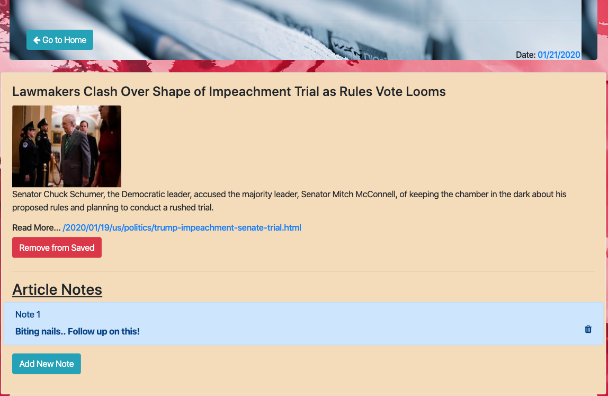
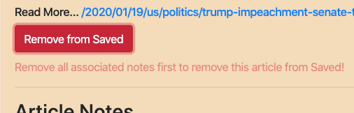
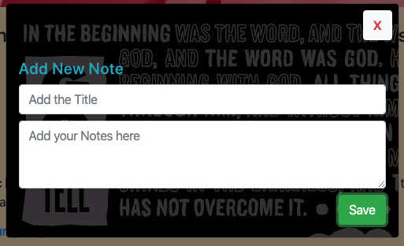
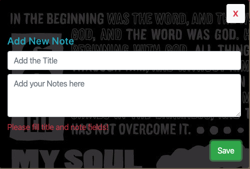

# Get-the-News-Articles

## You can do these things:

1. Get new news articles
2. Save articles
3. Add notes to individual articals
4. Remove Notes
5. Remove articles from saved

## Technologies and Libraries Used

- Javascript
- Express JS
- Node JS
- Handlebars
- MongoDB
- Mongoose
- Axios
- Cheerios
- Css
- Bootstrap 4

## Some Screenshots

- `scrap articles`

    

- `saved articles with notes`

    

- `notice while removing articles with notes from saved`

    

- `note modal`

    

- `empty text notice while trying to save note with no text`

    

## Checkout the website on Heroku

    - [Heroku link](https://news-scrapper-us.herokuapp.com/)
